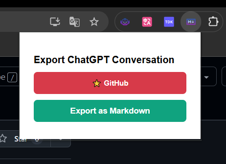

# ChatGPT Exporter

A simple Chrome extension to export your current ChatGPT conversation into a clean and readable **Markdown (.md)** file with proper formatting (including code blocks, roles, and structure).

## ✨ Features

- 📄 Export current conversation as a clean Markdown file  
- 💬 Retains user/assistant roles (`### User`, `### ChatGPT`)  
- 🧠 Supports code block formatting with correct language  
- 🎨 Auto theme support (light/dark) in popup UI  
- 🔒 No data collection or tracking  

## 📦 Installation

1. Clone or download this repository:
   ```bash
   git clone https://github.com/yang-shuohao/chatgpt-export.git
2. Open Google Chrome and go to:chrome://extensions/
3. Enable Developer mode (toggle in top right corner)
4. Click "Load unpacked", then select the folder where you downloaded/cloned the extension.
5. Pin the extension for easy access (optional).
## 🚀 Usage
1. Go to https://chat.openai.com/ and start or open any conversation.
2. Click the ChatGPT Exporter extension icon.
3. In the popup window, click "Export as Markdown".
4. A .md file will automatically download containing the full conversation, with roles and code blocks formatted.

## 🖼️ Screenshot


## 💰 Support This Project

If you find this project helpful, consider sponsoring or treating me a coffee ☕:

### 🧧 Donate via Chinese Payment (国内用户可扫码打赏)

<p align="center">
  
  
</p>

### 🌍 International Support

- [💸 Donate via PayPal](https://paypal.me/yangshuohao?country.x=C2&locale.x=zh_XC)

> Thank you for your support!